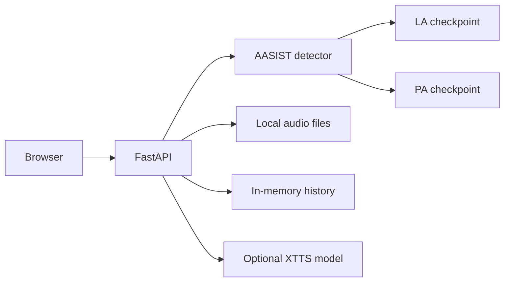

# Deployment design

## Current container

The Docker configuration runs the FastAPI app with generation disabled by default. The API, static frontend, and two detector checkpoints share one process. Audio is stored locally; metadata and history are stored in memory.

See the [deployment guide](../deployment/README.md) for commands and environment variables.

## Separate generation worker

A future deployment could move XTTS into a GPU worker and submit generation requests through a queue. The API and worker would share audio through object storage, with job state kept in a database.

This needs changes to the current generation path, which waits for an executor task before responding. Changes include job status, error handling, and storage access. The repository does not yet implement that architecture.

## Before choosing a host

Measure detector request latency, peak memory, and expected storage use. If generation is enabled, also measure XTTS load time and generation time with the selected weights. Use those measurements to size the service.
